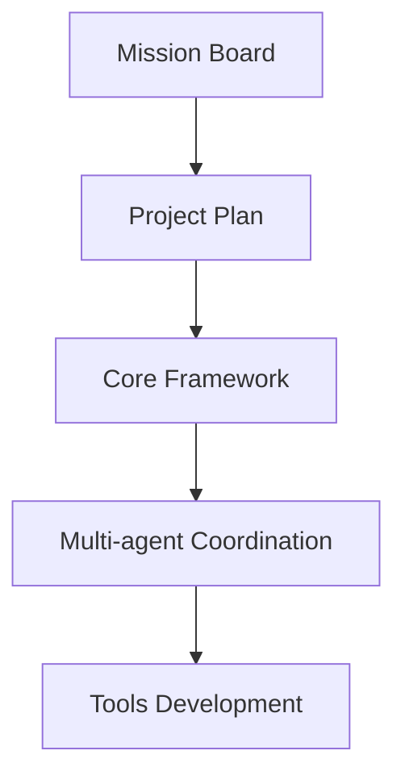

# 📅 AGENTOS PROJECT PLAN
*Version: 1.0*
*Last Updated: {CURRENT_DATE}*

---

## 🎯 PROJECT GOALS
1. Build a **multi-agent system** with efficient coordination
2. Create **self-optimizing** workflows
3. Implement **automated progress tracking**
4. Deliver **production-ready** tools

---

## 📆 TIMELINE

### Phase 1: Foundation (Week 1)
| Task | Owner | Deadline | Status |
|------|-------|----------|--------|
| Mission Board Optimization | Mistral Large | {TODAY+2} | IN PROGRESS |
| Project Plan Finalization | All Agents | {TODAY+3} | NOT STARTED |
| Core Framework v0.1 | GLM-5 | {TODAY+7} | NOT STARTED |

### Phase 2: Core Development (Week 2-3)
| Task | Owner | Deadline | Status |
|------|-------|----------|--------|
| Multi-agent coordination | GLM-5 | {TODAY+14} | NOT STARTED |
| Shared memory optimization | Mistral Large | {TODAY+10} | NOT STARTED |
| Web search tool | Kimi K2.5 | {TODAY+12} | NOT STARTED |

### Phase 3: Tools & Automation (Week 4)
| Task | Owner | Deadline | Status |
|------|-------|----------|--------|
| Testing pipeline | Groq Llama | {TODAY+21} | NOT STARTED |
| Progress dashboard | Mistral Large | {TODAY+18} | NOT STARTED |
| Documentation system | All Agents | {TODAY+25} | NOT STARTED |

---

## 🔧 DEPENDENCIES

---

## 📈 SUCCESS METRICS
1. **Task Completion Rate**: >90% of planned tasks
2. **Blocker Resolution Time**: <24 hours
3. **Agent Efficiency**: >80% productive time
4. **System Reliability**: 99.9% uptime

---

## 🚨 RISK MITIGATION
| Risk | Mitigation Strategy |
|------|---------------------|
| Delays in mission board | Daily standups, automated tracking |
| Agent coordination issues | Clear protocols, shared memory optimization |
| Scope creep | Strict prioritization, weekly reviews |